- [Recipes 'N' Stuff](#recipes-n-stuff)
          - [Fig 1: Responsive Mockup](#fig-1-responsive-mockup)
  - [Features](#features)
    - [Existing Features](#existing-features)
      - [Common Features](#common-features)
        - [Navigation Bar](#navigation-bar)
          - [Fig 2: Navigation Bar](#fig-2-navigation-bar)
    - [User registration and authentication](#user-registration-and-authentication)
          - [Fig 3: User registration and authentication](#fig-3-user-registration-and-authentication)
    - [User roles](#user-roles)
    - [User notifications](#user-notifications)
          - [Fig 4: User notifications](#fig-4-user-notifications)
    - [Content CRUD](#content-crud)
      - [Content creation](#content-creation)
      - [Content view](#content-view)
      - [Content edit](#content-edit)
      - [Content delete](#content-delete)
          - [Fig 5: Content CRUD](#fig-5-content-crud)
    - [Content interaction](#content-interaction)
          - [Fig 6: Content interaction](#fig-6-content-interaction)
    - [Content search](#content-search)
          - [Fig 6: Content search](#fig-6-content-search)
    - [Recipe feeds](#recipe-feeds)
          - [Fig 7: Recipe feeds](#fig-7-recipe-feeds)
    - [Future enhancements](#future-enhancements)
  - [Design](#design)
  - [Development and Local Deployment](#development-and-local-deployment)
    - [Environment](#environment)
    - [Setup](#setup)
      - [Clone Repository](#clone-repository)
      - [Virtual Environment](#virtual-environment)
      - [Environment Setup](#environment-setup)
      - [Python Setup](#python-setup)
        - [Production versus Development Setup](#production-versus-development-setup)
          - [Table 1: Configuration settings](#table-1-configuration-settings)
      - [Environment variables](#environment-variables)
        - [Secret Key Generation](#secret-key-generation)
      - [Social Account Login](#social-account-login)
        - [Google](#google)
        - [Twitter](#twitter)
    - [Before first run](#before-first-run)
      - [Initialise the database](#initialise-the-database)
      - [Populate the database](#populate-the-database)
      - [Create a superuser](#create-a-superuser)
      - [Build Bootstrap](#build-bootstrap)
      - [Configure authentication](#configure-authentication)
    - [Run server](#run-server)
    - [Application structure](#application-structure)
  - [Cloud-based Deployment](#cloud-based-deployment)
    - [Heroku CLI](#heroku-cli)
    - [Deployment](#deployment)
  - [Test](#test)
  - [Credits](#credits)
    - [Content](#content)
    - [Code](#code)


# Recipes 'N' Stuff

Recipes 'N' Stuff is an e-commerce site, focused on a community looking for recipe suggestions and online shopping convenience.
It utilises a subscription-based model, whereby registered users receive recipe suggestions, with the option to optionally purchase the
required ingredients.

The site is aimed at users seeking a platform seeking a source of inspirational recipe ideas, with a convenient online shopping experience.

###### Fig 1: Responsive Mockup


## Features

### Existing Features
#### Common Features

##### Navigation Bar

###### Fig 2: Navigation Bar


### User registration and authentication
Users may register for an account or alternatively use OAuth to sign in via their Google or Twitter accounts.

###### Fig 3: User registration and authentication
|                   User registration                   |                User authentication                 |
|:-----------------------------------------------------:|:--------------------------------------------------:|
|         |        | 
|                  **Chane password**                   |             **Manage email addresses**             | 
| 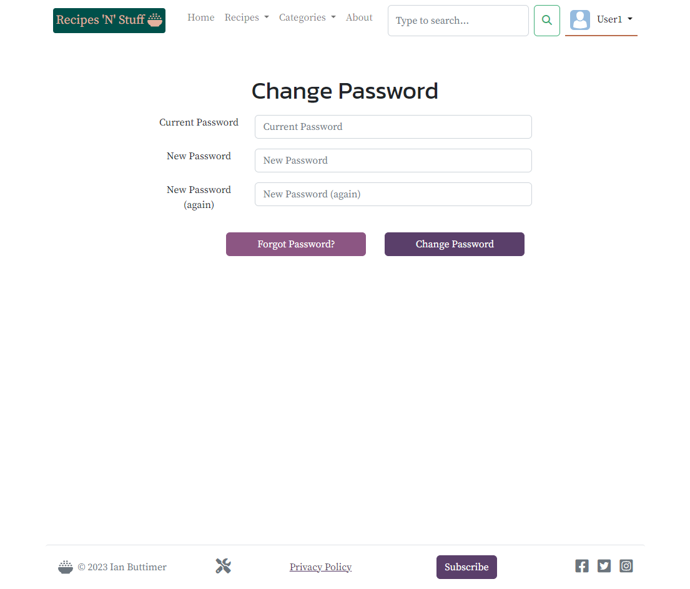 | 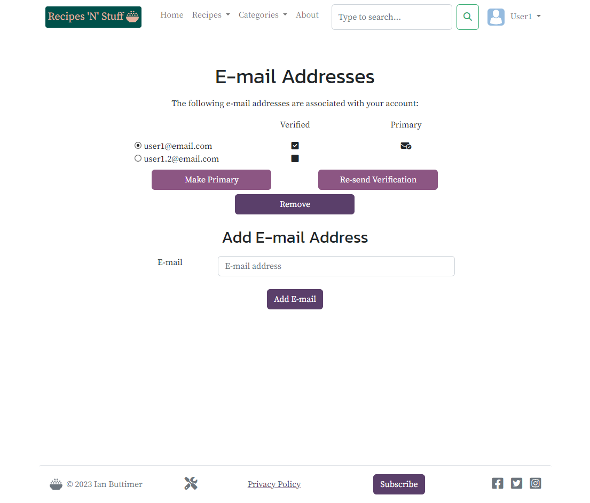 | 

### User roles
There are X user roles:
- Registered user

  Registered users may add/edit/delete their own recipes. All registered users may view any recipe on the site, and purchase ingredient boxes for any recipe on the site. 

- Site administrator

  The site administrator may perform all functions on the site.

### User notifications
Users receive notifications following sign in. These include a new user notification:

###### Fig 4: User notifications
|                       New user notification                       |                   Login notification                    |
|:-----------------------------------------------------------------:|:-------------------------------------------------------:|
|      |  | 
|                          **New content**                          |                                                         |
|   |                                                         | 

### Content CRUD
#### Content creation
Users may create recipes and addresses.
Site administrators may in addition, create subscription plans.  
#### Content view
All users may view all recipes. Individual users may view their addresses.
#### Content edit
Users may edit their recipes. Individual users may edit their addresses.
#### Content delete
Users may delete their recipes. Individual users may edit their addresses.

###### Fig 5: Content CRUD
|                      Create address                       |                                                                       Create recipe                                                                        |
|:---------------------------------------------------------:|:----------------------------------------------------------------------------------------------------------------------------------------------------------:|
|            |                                                       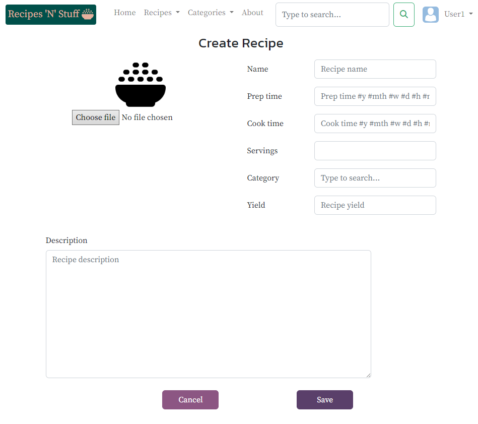                                                        | 
|                     **List address**                      |                                                                      **List recipes**                                                                      |
|        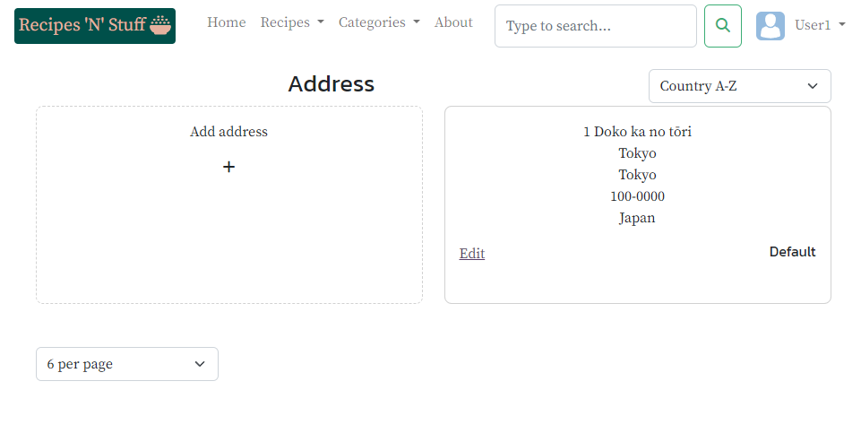        |                                                         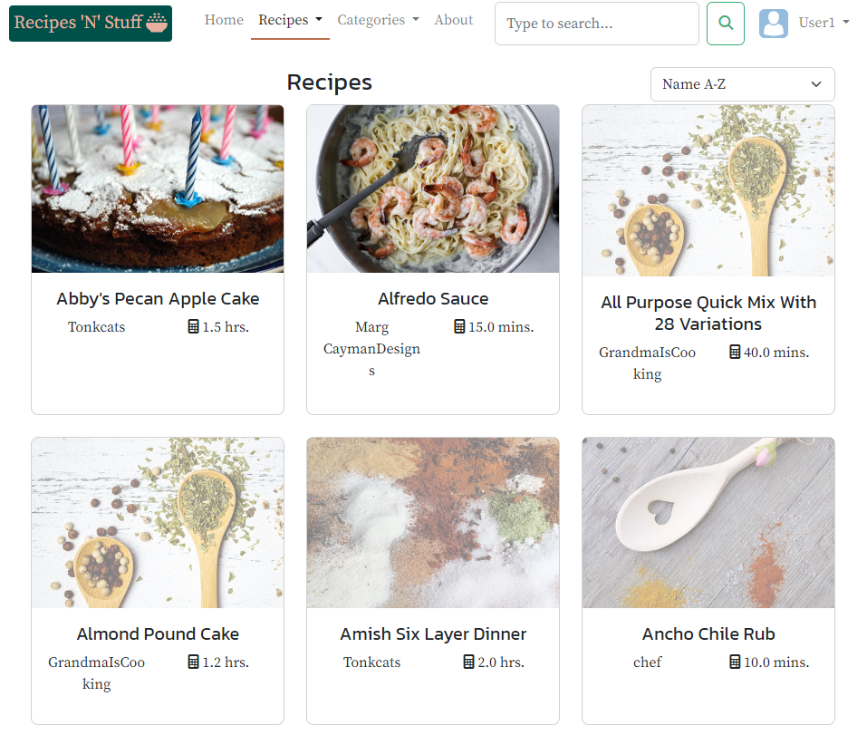                                                          | 
|                     **Edit address**                      |                                                                      **Edit recipe**                                                                       |
|        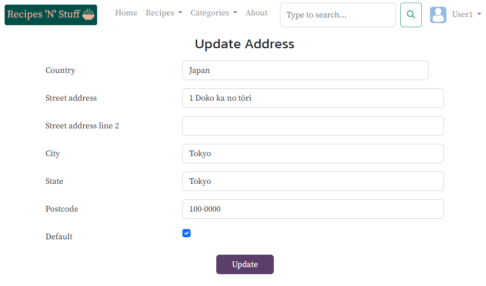        | 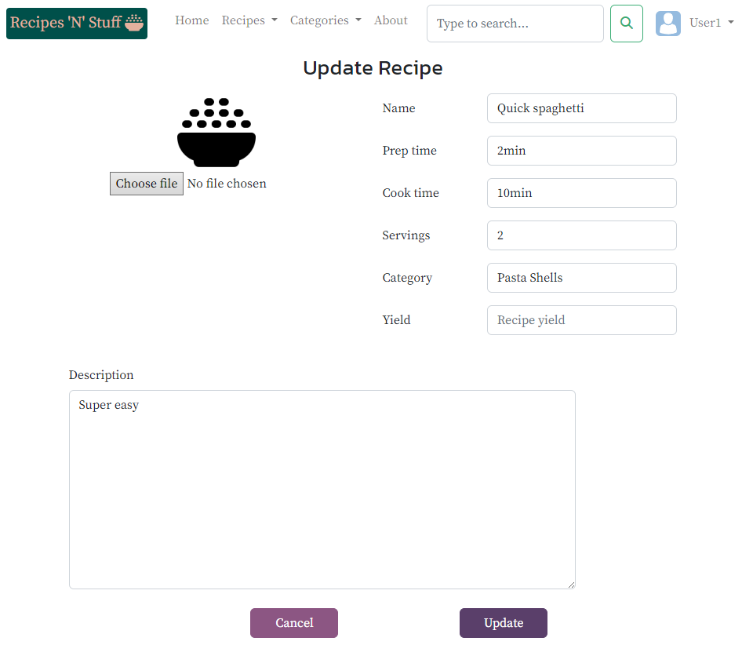<br>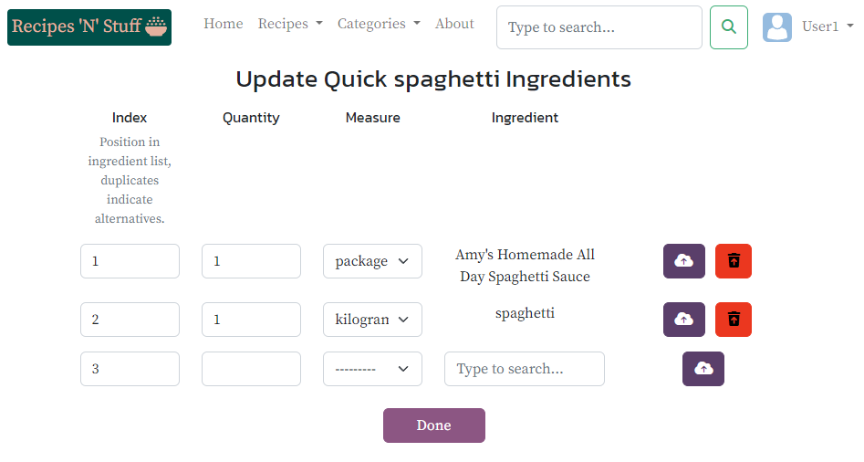<br>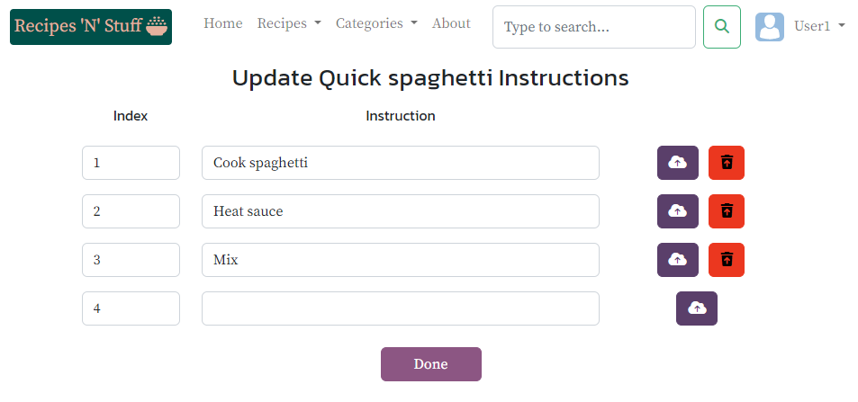 | 
|                    **Delete address**                     |                                                                     **Delete recipe**                                                                      |
|      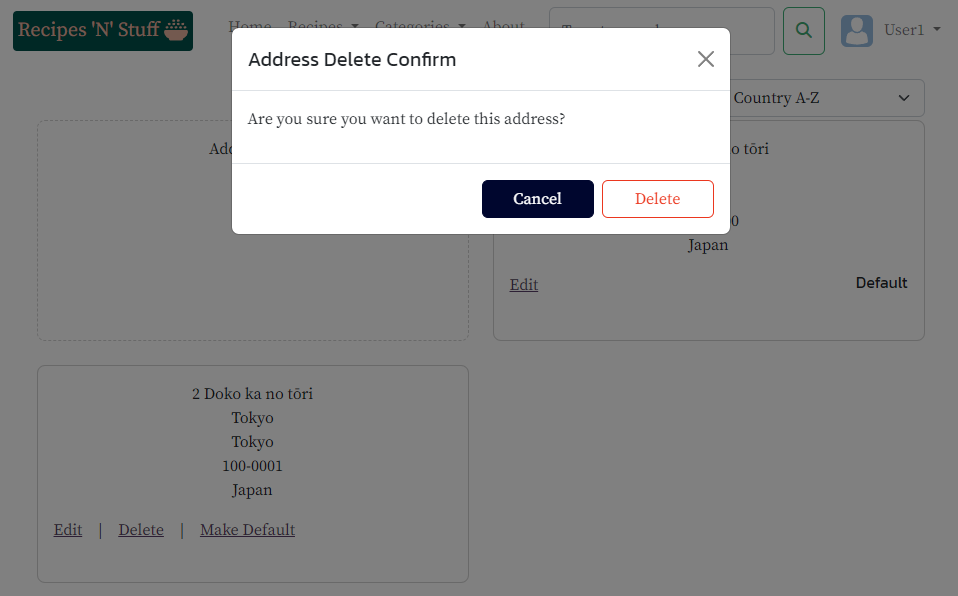      |                                                       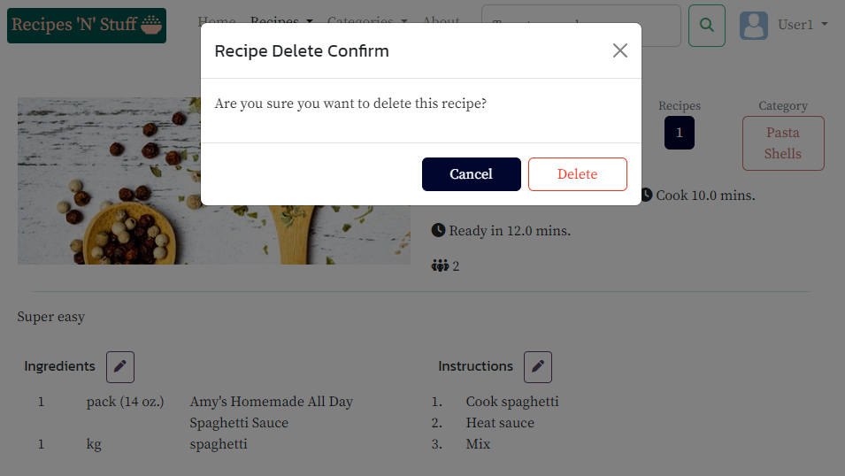                                                       | 
|           **Administrator-only functionality**            |                                                                                                                                                            |
|                  **Create subscription**                  |                                                                   **Edit subscription**                                                                    |
| 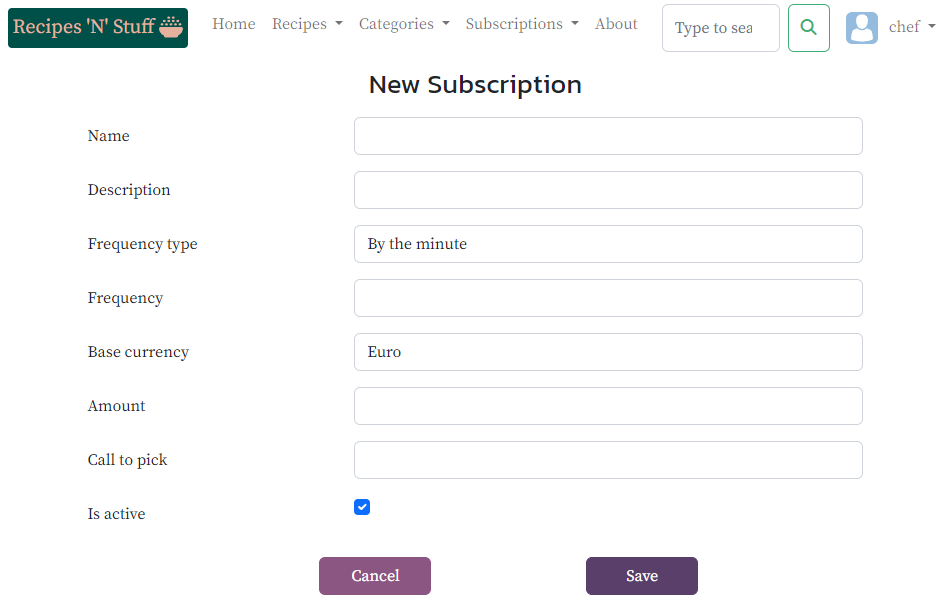 |                                                   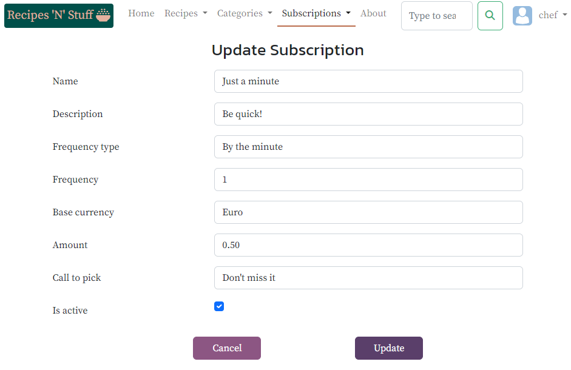                                                    | 
|                   **List subscription**                   |                                                                  **Delete subscription**                                                                   |
|   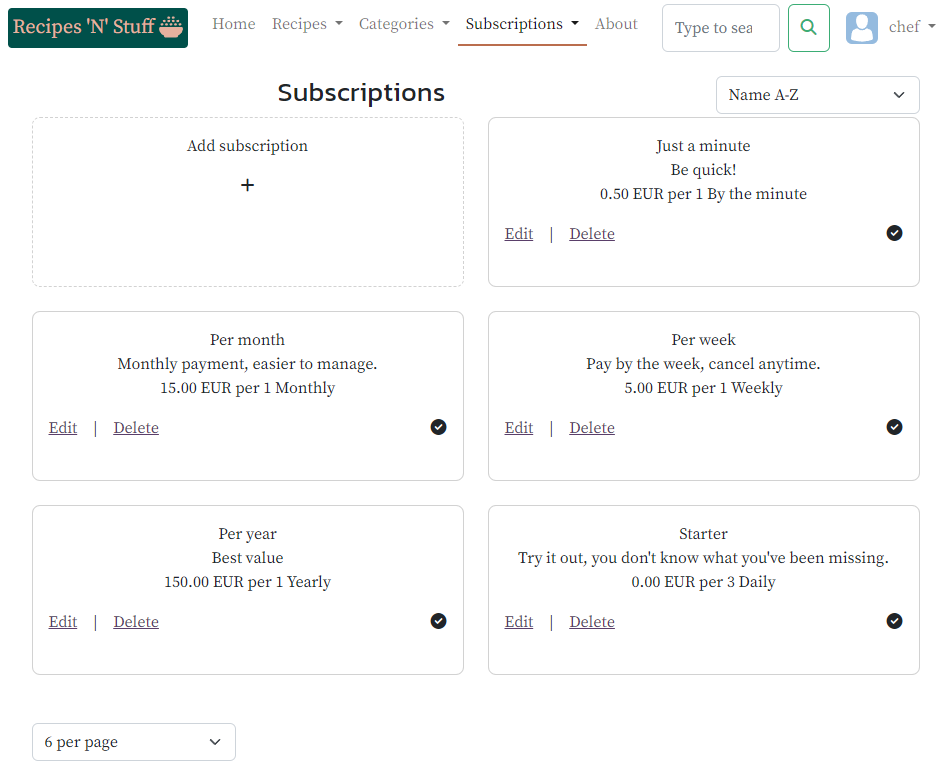   |                                                 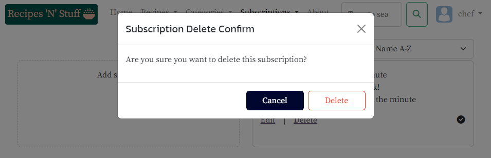                                                  | 

> **Note:** Subscription creation is incomplete as it is necessary to create and assign subscription features in the Administration page. [User Story: Subscription features](https://github.com/ibuttimer/recipes-n-stuff/issues/63). 

### Content search
Users may search for recipes via search box in the navbar at the top of the screen.
The search box allows user's to either perform a free word search or select from a predetermined keyword list.

###### Fig 6: Content search
|             Search box              |                 Search result                 |
|:-----------------------------------:|:---------------------------------------------:|
| 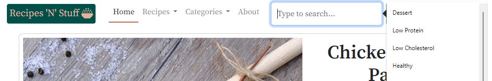 | 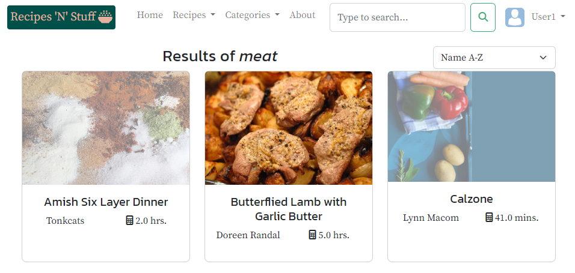 | 


### Search Engine Optimisation
The SEO features include:
- robots.txt
    The [robots.txt](https://recipesnstuff.herokuapp.com/robots.txt) file is generated by the application. A [copy](robots.txt) is included for reference.
- sitemap.xml
    The [sitemap.xml](https://recipesnstuff.herokuapp.com/sitemap.xml) file is generated by the application. A [copy](sitemap.xml) is included for reference.

### Marketing
The marketing features include:
- Facebook business page
    A [Facebook business page](https://www.facebook.com/profile.php?id=100090978770562) was created, and a snapshot is available [here](doc/media/facebook_business_page.png)

### Future enhancements
Future enhancements are logged in [GitHub Issues](https://github.com/ibuttimer/recipes-n-stuff/issues?q=is%3Aissue+is%3Aopen+label%3Aenhancement).

Future features are logged in [GitHub Issues](https://github.com/ibuttimer/recipes-n-stuff/issues?q=is%3Aissue+is%3Aopen+label%3Afeature)

## Design
The design specification is available in [design.md](doc/design/design.md).

## Development and Local Deployment
### Environment
The development environment requires:

| Artifact                                 | Download and installation instructions               |
|------------------------------------------|------------------------------------------------------|
| [Node.js](https://nodejs.org/)           | https://nodejs.org/en/download/                      |
| [npm](https://www.npmjs.com/)            | Included with Node.js installation                   |
| [git](https://git-scm.com/)              | https://git-scm.com/downloads                        |
| [Python](https://www.python.org/)        | https://www.python.org/downloads/                    |
| [Django](https://www.djangoproject.com/) | https://www.djangoproject.com/download/              |

### Setup
#### Clone Repository
In an appropriate folder, run the following commands:
```shell
> git clone https://github.com/ibuttimer/recipes-n-stuff.git
> cd recipes-n-stuff
```
Alternatively, most IDEs provide an option to create a project from Version Control.

#### Virtual Environment
It is recommended that a virtual environment be used for development purposes.
Please see [Creating a virtual environment](https://packaging.python.org/guides/installing-using-pip-and-virtual-environments/#creating-a-virtual-environment) for details.

> __Note:__ Make sure to [activate the virtual environment](https://packaging.python.org/en/latest/guides/installing-using-pip-and-virtual-environments/#activating-a-virtual-environment).

#### Environment Setup
In a terminal window, in the `recipes-n-stuff` folder, run the following command to setup required environment artifacts:
```shell
> npm install
```

#### Python Setup
In the `recipes-n-stuff` folder, run the following command to install the necessary python packages:
```shell
> pip install -r requirements-dev.txt
```
##### Production versus Development Setup
There are two requirements files:
* [requirements.txt](requirements.txt) which installs the production requirements, and
* [requirements-dev.txt](requirements-dev.txt) which installs extra development-only requirements in addition to the production requirements from [requirements.txt](requirements.txt)

###### Table 1: Configuration settings
| Key                      | Value                                                                                                                                                                                                                                                                                                                                                                                                                                                                                   |
|--------------------------|-----------------------------------------------------------------------------------------------------------------------------------------------------------------------------------------------------------------------------------------------------------------------------------------------------------------------------------------------------------------------------------------------------------------------------------------------------------------------------------------|
| ENV_FILE                 | If using an environment file, specifies the file to use. Defaults to `.env` in the project root folder.                                                                                                                                                                                                                                                                                                                                                                                 |
| PORT                     | Port application is served on; default 8000                                                                                                                                                                                                                                                                                                                                                                                                                                             |
| DEBUG                    | A boolean that turns on/off debug mode; see [Boolean environment variables](#boolean-environment-variables)                                                                                                                                                                                                                                                                                                                                                                             |
| DEVELOPMENT              | A boolean that turns on/off development mode; see [Boolean environment variables](#boolean-environment-variables)                                                                                                                                                                                                                                                                                                                                                                       |
| TEST                     | A boolean that turns on/off test mode; see [Boolean environment variables](#boolean-environment-variables). Only valid when development mode is enabled.                                                                                                                                                                                                                                                                                                                                |
| DBG_TOOLBAR              | A boolean that enables/disables [Django Debug Toolbar](https://pypi.org/project/django-debug-toolbar/); see [Boolean environment variables](#boolean-environment-variables). Only valid when debug mode is enabled.                                                                                                                                                                                                                                                                     |
| SECRET_KEY               | [Secret key](https://docs.djangoproject.com/en/4.1/ref/settings/#std-setting-SECRET_KEY) for a particular Django installation. See [Secret Key Generation](#secret-key-generation)                                                                                                                                                                                                                                                                                                      |
| DATABASE_URL             | [Database url](https://docs.djangoproject.com/en/4.1/ref/settings/#databases)                                                                                                                                                                                                                                                                                                                                                                                                           |
| CLOUDINARY_URL           | [Cloudinary url](https://pypi.org/project/dj3-cloudinary-storage/)                                                                                                                                                                                                                                                                                                                                                                                                                      |
| AVATAR_BLANK_URL         | Url of [blank avatar](static/img/avatar_blank.svg)                                                                                                                                                                                                                                                                                                                                                                                                                                      |
| RECIPE_BLANK_URL         | Url of [placeholder recipe image](static/img/bowl-rice.png)                                                                                                                                                                                                                                                                                                                                                                                                                             |
| SITE_ID                  | Id (primary key) of site in the `django_site` table of the database. See [Configure authentication](#configure-authentication).                                                                                                                                                                                                                                                                                                                                                         |
| HEROKU_HOSTNAME          | [Hostname](https://docs.djangoproject.com/en/4.1/ref/settings/#allowed-hosts) of application on Heroku.<br>__Note:__ To specify multiple hosts, use a comma-separated list with no spaces.<br>__Note:__ Set to `localhost,127.0.0.1` in local development mode                                                                                                                                                                                                                          |
| REMOTE_DATABASE_URL      | Url of remote PostgreSQL database resource.<br>For a Heroku app with a [Heroku Postgres](https://elements.heroku.com/addons/heroku-postgresql) addon this is available from `DATABASE_URL` in the app `Settings -> Config Vars`.<br>For an [ElephantSQL](https://www.elephantsql.com/) database this is available from `URL` in the instance details.<br>__Note:__ Only required for admin purposes, see database configuration under [Cloud-based Deployment](#cloud-based-deployment) |
| GOOGLE_SITE_VERIFICATION | [Google Search Console](https://search.google.com/search-console) meta tag verification value for [site ownership verification](https://support.google.com/webmasters/answer/9008080?hl=en)                                                                                                                                                                                                                                                                                             |
| STRIPE_PUBLISHABLE_KEY   | [Stripe Developer API keys](https://dashboard.stripe.com/test/apikeys) publishable key value for payments processing.                                                                                                                                                                                                                                                                                                                                                                   |
| STRIPE_SECRET_KEY        | [Stripe Developer API keys](https://dashboard.stripe.com/test/apikeys) secret key value for payments processing.                                                                                                                                                                                                                                                                                                                                                                        |
| STRIPE_WEBHOOK_KEY       | [Stripe Webhook secret](https://dashboard.stripe.com/test/webhooks/create) secret key value to get incoming webhooks to get real-time updates. See [Test webhooks integration](https://stripe.com/docs/webhooks/test) for local testing and [Take webhooks live](https://stripe.com/docs/webhooks/go-live) for hosted deployment.                                                                                                                                                       |
| EXCHANGERATES_DATA_KEY   | [Exchange Rates Data API](https://apilayer.com/marketplace/exchangerates_data-api) key for exchange rates.                                                                                                                                                                                                                                                                                                                                                                              |
| DEFAULT_SEND_EMAIL       | Email address to send emails from. Only valid when development mode is enabled, in production mode emails are sent from `EMAIL_HOST_USER`                                                                                                                                                                                                                                                                                                                                               |
| EMAIL_HOST               | SMTP server to send email. Only valid when production mode is enabled.                                                                                                                                                                                                                                                                                                                                                                                                                  |
| EMAIL_USE_TLS            | Use Transport Layer Security (TLS) flag; see [Boolean environment variables](#boolean-environment-variables), default true. Only valid when production mode is enabled.                                                                                                                                                                                                                                                                                                                 |
| EMAIL_PORT               | SMTP server port. Only valid when production mode is enabled.                                                                                                                                                                                                                                                                                                                                                                                                                           |
| EMAIL_HOST_USER          | Email user account to send email. Only valid when production mode is enabled.                                                                                                                                                                                                                                                                                                                                                                                                           |
| EMAIL_HOST_PASSWORD      | Email user account password. Only valid when production mode is enabled.                                                                                                                                                                                                                                                                                                                                                                                                                |
| FACEBOOK_PAGE            | Facebook business page link.                                                                                                                                                                                                                                                                                                                                                                                                                                                            |

#### Boolean environment variables
Set environment variables evaluating a boolean value, should be set to any of `true`, `on`, `ok`, `y`, `yes` or `1` to set true, otherwise the variable is evaluated as false.

#### Environment variables
Set environment variables corresponding to the keys in [Table 1: Configuration settings](#table-1-configuration-settings).

E.g.
```shell
For Linux and Mac:                       For Windows:
$ export DEVELOPMENT=true                > set DEVELOPMENT=true
```

##### Secret Key Generation
A convenient method of generating a secret key is to run the following command and copy its output.

```shell
$ python -c "import secrets; print(secrets.token_urlsafe())"
```

#### Social Account Login
In order to configure social account login, the following actions must be performed.

##### Google
The Google provider is [OAuth2](https://developers.google.com/identity/protocols/OAuth2) based,
and a Google app is needed to obtain a key and secret through the [Google Developer Console](https://console.developers.google.com/).

- Login to the [Google Developer Console](https://console.developers.google.com/)
- Click on the `Select a project` button and then select `New Project`
* Give the project a name and click `Create`
* Once created click `Select Project` on the notification or select the project from the `Select a project` modal
* From the sidebar menu select [APIs & Services -> Credentials](https://console.cloud.google.com/apis/credentials)
* Select `CREATE CREDENTIALS` and `OAuth client ID` from the dropdown as the type of credential
* Select `Web application` as the application type, and specify a `Name`
* Add the site domain name or test domain name in `Authorized JavaScript origins`
* Add the `http://127.0.0.1:8000/accounts/google/login/callback/` in `Authorised redirect URIs`
* Select `CREATE`
* From the `OAuth client created` modal, copy the `Client ID` and `Client Secret` or download the information in JSON format.
* From the sidebar menu select `APIs & Services -> OAuth consent screen`
* Provide the following App information
    * App name
    * User support email
    * App logo
* Under `Authorised domains` add the site domain
* Add an email address for `Developer contact information`
* Select `SAVE AND CONTINUE`
* Under `Authorised domains`, select `ADD OR REMOVE SCOPES` and check the boxes for `.../auth/userinfo.email` and `.../auth/userinfo.profile`
* Select `SAVE AND CONTINUE`
* Under `Test users`, add the email address for the Google accounts to be used in testing
* Select `SAVE AND CONTINUE`

##### Twitter
* Login to Twitter and signup to the [Developer Portal](https://developer.twitter.com/en/portal/dashboard)
* Create a new app and save the Consumer Keys: `API Key`, `API Key Secret` and `Bearer Token`
* Open the app in the dashboard and under `User authentication settings`, select `Set up`
* Select `Web App, Automated App or Bot` for `Type of App`
* Under `App info`, set
    * `Callback URI / Redirect URL` to `http://127.0.0.1:8000/accounts/twitter/login/callback/`
    * `Website URL` to the Heroku app URL, e.g. [https://recipesnstuff.herokuapp.com/](https://recipesnstuff.herokuapp.com/)
    * `Organization name` to `SoapBox`
* Select `Save`, and copy the OAuth 2.0 Client ID and Client Secret displayed, and store securely.
* Select `Done`
* It is necessary to [apply for Elevated access](https://developer.twitter.com/en/portal/products/elevated) to the Twitter API, in order to access to private resources.
  Without Elevated access it is not possible to use Twitter as a sign in provider

#### Stripe
In order to configure Stripe payments, the following actions must be performed.

##### App setup
* Login to [Stripe](https://stripe.com/)
* Create a new application, and go to the [Developers Dashboard](https://dashboard.stripe.com/test/developers)
* Ensure the application is selected in the application list dropdown
* Select [API keys](https://dashboard.stripe.com/test/apikeys) and copy the `Publishable key` and `Secret key`, and store securely.

##### Webhook setup
* Login to [Stripe](https://stripe.com/)
* Goto the [Developers Dashboard](https://dashboard.stripe.com/test/developers) for the application
* Goto [Webhooks](https://dashboard.stripe.com/test/webhooks) and setup a _Local listener_ for testing or a _Hosted endpoint_ for deployment
* Copy the `webhook signing secret` and store securely.

#### Exchange Rates
In order to configure Exchange Rates, the following actions must be performed.

* Login to [APILayer](https://apilayer.com/)
* Subscribe to the [Exchange Rates Data API](https://apilayer.com/marketplace/exchangerates_data-api)
* Copy the API key, and store securely

#### Email
Procedures differ depending on the email provider used.
for example, in order to configure Gmail as the email provider, the following actions must be performed.

* Login to [Gmail](https://mail.google.com/)
* Goto the Google Account settings and select [Security](https://myaccount.google.com/security)
* Under `How you sign in to Google` ensure 2-Step Verification is enabled 
* Search for `App passwords` and create a new app password 
* Copy the generated app password, and store securely


### Before first run
Before running the application for the first time following cloning from the repository and setting up a new database,
the following steps must be performed, from a terminal window, in the `recipes-n-stuff` folder.

#### Initialise the database
````shell
$ python manage.py migrate
````

#### Populate the database
Download the recipe data from [Food.com - Recipes and Reviews](https://www.kaggle.com/datasets/irkaal/foodcom-recipes-and-reviews)
and save the `recipes.parquet` file to [data](data) folder. 

Populate the database with predefined data via the [populate.py](data/populate.py) script.
When run using [run_populate.py](run_populate.py) it will load the data from [subdivisions.txt](data/subdivisions.txt).

> **Note:** When loading the database ensure to specify the correct database:
>           `--database default` when loading a local development database 
>           `--database remote` when loading a Database as a service (DBaaS) database 

From the project root folder run the following

##### Measures table
```bash
# E.g. populate the remote database 
python -m manage loaddata measure.json --database remote
```
<details>
<summary><em>Dump data:</em></summary>

```bash
python -m manage dumpdata recipes.Measure --indent 4 -o data/fixtures/measure.json
```
</details>

##### Currencies table
```bash
# populate the remote database via loaddata 
python -m manage loaddata currencies.json --database remote
# or alternatively via run_populate.py
python run_populate.py -cc -f data -dv REMOTE_DATABASE_URL
```
<details>
<summary><em>Dump data:</em></summary>

The data dump needs to be performed in [UTF8 mode](https://docs.python.org/3/using/cmdline.html#cmdoption-X) to
preserve character encodings: 
```bash
python -Xutf8 -m manage dumpdata checkout.Currency --indent 4 -o data/fixtures/currencies.json
```
</details>

##### Countryinfo table
```bash
# populate the remote database via loaddata 
python -m manage loaddata countryinfo.json --database remote
# or alternatively via run_populate.py
python run_populate.py -c -f data -dv REMOTE_DATABASE_URL
```
<details>
<summary><em>Dump data:</em></summary>

```bash
python -m manage dumpdata profiles.CountryInfo --indent 4 -o data/fixtures/countryinfo.json
```
</details>

##### Recipe tables
> **Note:** Due to the large size of the dataset, this operation takes a long time to complete.

```bash
# E.g. populate the remote database 
python run_populate.py -r -f data -dv REMOTE_DATABASE_URL
```
#### Create a superuser
Enter `Username`, `Password` and optionally `Email address`.
````shell
$ python manage.py createsuperuser
````
#### Build Bootstrap
Build a customised version of Bootstrap.
````shell
$ npm run build
````

#### Configure authentication
From [django-allauth Post-Installation](https://django-allauth.readthedocs.io/en/latest/installation.html#post-installation)
- Add a Site for your domain in the database
    - Login to `http://&lt;domain&gt;/admin/sites/site/` as the previously created superuser, e.g. http://127.0.0.1:8000/admin/sites/site/
    - Add a Site for your domain (django.contrib.sites app).

      E.g.

      | Domain name    | Display name   |
      |----------------|----------------| 
      | 127.0.0.1:8000 | my domain      | 

      __Note:__ The id (primary key) of the site must be added to the application configuration. See `SITE_ID` in [Table 1: Configuration settings](#table-1-configuration-settings).

- For each OAuth based provider, add a SocialApp in `http://&lt;domain&gt;/admin/socialaccount/socialapp/`,
  e.g. http://127.0.0.1:8000/admin/socialaccount/socialapp/, containing the required client credentials

    - Google
      [django-allauth Google provider info](https://django-allauth.readthedocs.io/en/latest/providers.html#google)

      | Provider | Name   | Client id                                          | Secret key                                            | 
      |----------|--------|----------------------------------------------------|-------------------------------------------------------| 
      | google   | Google | `client_id` from the OAuth 2.0 Client credentials  | `client_secret` from the OAuth 2.0 Client credentials | 

      And add the Site for your domain to the `Chosen sites` list

    - Twitter
      [django-allauth Twitter provider info](https://django-allauth.readthedocs.io/en/latest/providers.html#twitter)

      | Provider | Name    | Client id                          | Secret key                              | 
      |----------|---------|------------------------------------|-----------------------------------------| 
      | twitter  | Twitter | `API Key` from the Consumer Keys   | `API Key Secret` from the Consumer Keys | 

      And add the Site for your domain to the `Chosen sites` list

### Run server
In order to run the development server, run the following command from the `recipes-n-stuff` folder:

````shell
$ python manage.py runserver
````

By default, the server runs on port 8000 on the IP address 127.0.0.1.
See [runserver](https://docs.djangoproject.com/en/4.1/ref/django-admin/#runserver) for details on passing an IP address and port number explicitly.


### Application structure
The application structure is as follows:

```
├─ README.md            - this file
├─ doc                  - documentation
│  ├─ agile             - project management
│  ├─ design            - design related documentation
│  └─ test              - test reports
├─ data                 - sample data
├─ manage.py            - application entry point
├─ recipesnstuff        - main Django application
├─ base                 - base Django application
│  └─ static            - base application-specific static files
│     ├─ css            - base application-specific custom CSS
│     ├─ img            - base application-specific images
│     └─ js             - base application-specific custom JavaScript
├─ checkout             - checkout Django application
│  └─ static            - checkout application-specific static files
│     ┇
├─ recipes              - recipes Django application
├─ profiles             - shopping profiles Django application
├─ subscription         - subscriptions Django application
├─ user                 - user Django application
├─ static               - static files
│  ├─ css               - custom CSS
│  ├─ img               - images
│  └─ js                - custom JavaScript
├─ templates            - application templates
├─ django_tests         - Django Test Tools test scripts
├─ jest_tests           - Jest javascript tests
└─ tests                - pytest/unittest test scripts
```

## Cloud-based Deployment

The site was deployed on [Heroku](https://www.heroku.com).

### Heroku CLI
Optionally, the [Heroku CLI](https://devcenter.heroku.com/articles/heroku-cli) may be used to update the application on Heroku.
With the Heroku CLI installed, in a terminal window, in the `recipes-n-stuff` folder:
- Log in to your Heroku account and follow the prompts to create a new SSH public key.

  ```shell
  $ heroku login
  ```

### Deployment
The following steps were followed to deploy the website:
- Login to Heroku in a browser
- From the dashboard select `New -> Create new app`
- Set the value for `App name`, choose the appropriate region and click `Create app`
- To provision the application with a database, a [Heroku Postgres](https://elements.heroku.com/addons/heroku-postgresql) database or alternative, such as an [ElephantSQL](https://www.elephantsql.com/) database may be utilised.
    - For [Heroku Postgres](https://elements.heroku.com/addons/heroku-postgresql), from the app settings, select the `Resources` tab.
        - Under `Add-ons` add the following
            1. `Heroku Postgres` - PostgreSQL [database as a service](https://elements.heroku.com/addons/heroku-postgresql)
    - For [ElephantSQL](https://www.elephantsql.com/) database, follow the `Create a new instance` instructions under the `Getting started` section of the [ElephantSQL documentation](https://www.elephantsql.com/docs/index.html).
- From the app settings, select the `Resources` tab.
    - Under `Add-ons` add the following
        1. `Cloudinary - Image and Video Management` - [Cloudinary Image & Video Tools](https://elements.heroku.com/addons/cloudinary)

           __Note:__ In order the access the dashboard for the provisioned Cloudinary account, use the [Heroku CLI](https://devcenter.heroku.com/articles/cloudinary#management-console)
              ```shell
              $ heroku addons:open cloudinary --app=recipesnstuff
              ```

- From the app settings, select the `Settings` tab.
    - Under `Buildpacks` add the following buildpacks
        1. `heroku/python`
    - Under `Config Vars` add the following environment variables

    | Key                      | Value                                                                                                                                                                                                                                                                                                                             |
    |--------------------------|-----------------------------------------------------------------------------------------------------------------------------------------------------------------------------------------------------------------------------------------------------------------------------------------------------------------------------------|
    | PORT                     | 8000                                                                                                                                                                                                                                                                                                                              |
    | SECRET_KEY               | [Secret key](https://docs.djangoproject.com/en/4.1/ref/settings/#std-setting-SECRET_KEY) for a particular Django installation                                                                                                                                                                                                     |
    | HEROKU_HOSTNAME          | [Hostname](https://docs.djangoproject.com/en/4.1/ref/settings/#allowed-hosts) of application on Heroku                                                                                                                                                                                                                            |
    | AVATAR_BLANK_URL         | Url of blank avatar                                                                                                                                                                                                                                                                                                               |
    | RECIPE_BLANK_URL         | Url of placeholder recipe image                                                                                                                                                                                                                                                                                                   |
    | SITE_ID                  | Id (primary key) of site in the `django_site` table of the database. See [Configure authentication](#configure-authentication).                                                                                                                                                                                                   |
    | GOOGLE_SITE_VERIFICATION | [Google Search Console](https://search.google.com/search-console) meta tag verification value for [site ownership verification](https://support.google.com/webmasters/answer/9008080?hl=en)                                                                                                                                       |
    | STRIPE_PUBLISHABLE_KEY   | [Stripe Developer API keys](https://dashboard.stripe.com/test/apikeys) publishable key value for payments processing.                                                                                                                                                                                                             |
    | STRIPE_SECRET_KEY        | [Stripe Developer API keys](https://dashboard.stripe.com/test/apikeys) secret key value for payments processing.                                                                                                                                                                                                                  |
    | STRIPE_WEBHOOK_KEY       | [Stripe Webhook secret](https://dashboard.stripe.com/test/webhooks/create) secret key value to get incoming webhooks to get real-time updates. See [Test webhooks integration](https://stripe.com/docs/webhooks/test) for local testing and [Take webhooks live](https://stripe.com/docs/webhooks/go-live) for hosted deployment. |
    | EXCHANGERATES_DATA_KEY   | [Exchange Rates Data API](https://apilayer.com/marketplace/exchangerates_data-api) key for exchange rates.                                                                                                                                                                                                                        |
    | EMAIL_HOST               | SMTP server to send email.                                                                                                                                                                                                                                                                                                        |
    | EMAIL_USE_TLS            | Use Transport Layer Security (TLS) flag.                                                                                                                                                                                                                                                                                          |
    | EMAIL_PORT               | SMTP server port.                                                                                                                                                                                                                                                                                                                 |
    | EMAIL_HOST_USER          | Email user account to send email.                                                                                                                                                                                                                                                                                                 |
    | EMAIL_HOST_PASSWORD      | Email user account password.                                                                                                                                                                                                                                                                                                      |
    | FACEBOOK_PAGE            | Facebook business page link.                                                                                                                                                                                                                                                                                                      |
    |                          | _The following keys are automatically added when `Resources` are provisioned:_                                                                                                                                                                                                                                                    |
    | CLOUDINARY_URL           | [Cloudinary url](https://pypi.org/project/dj3-cloudinary-storage/)                                                                                                                                                                                                                                                                |

    - Add the `DATABASE_URL` environment variable under `Config Vars`, if required
    
    | Key           | Value                                                                                                                                                                                                                                                                                                                              |
    |---------------|------------------------------------------------------------------------------------------------------------------------------------------------------------------------------------------------------------------------------------------------------------------------------------------------------------------------------------|
    | DATABASE_URL  | [Database url](https://docs.djangoproject.com/en/4.1/ref/settings/#databases)<br>- [Heroku Postgres](https://elements.heroku.com/addons/heroku-postgresql) database, automatically added when `Resources` are provisioned<br>- [ElephantSQL](https://www.elephantsql.com/) database, copy the `URL` from the instance details page |


See [Table 1: Configuration settings](#table-1-configuration-settings) for details.

If any other settings vary from the defaults outlined in [Table 1: Configuration settings](#table-1-configuration-settings) they must be added as well.

- From the app settings, select the `Deploy` tab.
    - For the `Deployment method`, select `GitHub` and link the Heroku app to the GitHub repository.

      __Note:__ To configure GitHub integration, you have to authenticate with GitHub. You only have to do this once per Heroku account. See [GitHub Integration (Heroku GitHub Deploys)](https://devcenter.heroku.com/articles/github-integration).
    - `Enable Automatic Deploys` under `Automatic deploys` to enable automatic deploys from GitHub following a GitHub push if desired.
    - The application may also be deployed manually using `Deploy Branch` under `Manual deploy`
    - Alternatively, the application may be deployed via the [Heroku CLI](#heroku-cli).
      After logging into the Heroku CLI in a terminal window, in the `recipes-n-stuff` folder:
        - Check the list of `git` remotes

          ```shell
          $ git remote -v
          origin  https://github.com/ibuttimer/recipes-n-stuff.git (fetch)
          origin  https://github.com/ibuttimer/recipes-n-stuff.git (push)
          ```

        - If there is no `git` remotes for `heroku` listed, add one

            ```shell
            $ git remote add heroku https://git.heroku.com/recipesnstuff.git
  
            $ git remote -v       
            heroku  https://git.heroku.com/recipesnstuff.git (fetch)
            heroku  https://git.heroku.com/recipesnstuff.git (push)
            origin  https://github.com/ibuttimer/recipes-n-stuff.git (fetch)
            origin  https://github.com/ibuttimer/recipes-n-stuff.git (push)
            ```

        - After committing change locally, push to Heroku

            ```shell
            $ git push heroku main
            ```

- Initialise the database and Create a superuser

  Involves the same procedure as outlined in [Initialise the database](#initialise-the-database) and [Create a superuser](#create-a-superuser)
  but may be run from the local machine.
    - From a [Development and Local Deployment](#development-and-local-deployment)
        - Initialise the database
          ````shell
          $ python manage.py migrate --database=remote
          ````
        - Create a superuser

          Enter `Username`, `Password` and optionally `Email address`.
          ````shell
          $ python manage.py createsuperuser --database=remote
          ````

      __Note:__ Ensure to specify the `--database=remote` option to apply the change to the database specified by the `REMOTE_DATABASE_URL` environment variable.

    - Alternatively, the [Heroku CLI](#heroku-cli) may be utilised.

      After logging into the Heroku CLI in a terminal window, in the project folder:
        - Initialise the database
          ````shell
          $  heroku run python manage.py migrate --app recipesnstuff
          ````
        - Create a superuser

          Enter `Username`, `Password` and optionally `Email address`.
          ````shell
          $ heroku run python manage.py createsuperuser --app recipesnstuff
          ````
- Configure authentication

  Follow the same procedure as outlined in [Configure authentication](#configure-authentication) using the
  Heroku domain as `&lt;domain&gt;`, e.g. `recipesnstuff.herokuapp.com`

The live website is available at [https://recipesnstuff.herokuapp.com/](https://recipesnstuff.herokuapp.com/)

## Test
The tests information and results are available in [test.md](doc/test/test.md).


## Credits

The following resources were used to build the website.

### Content

- Logo [bowl rice image](https://github.com/FortAwesome/Font-Awesome/blob/6.x/svgs/solid/bowl-rice.svg), [Icons License](https://github.com/FortAwesome/Font-Awesome#license) [CC BY 4.0](https://creativecommons.org/licenses/by/4.0/), by [Font Awesome](https://fontawesome.com/)
- The favicon for the site was generated by [RealFaviconGenerator](https://realfavicongenerator.net/) from [bowl rice image](https://github.com/FortAwesome/Font-Awesome/blob/6.x/svgs/solid/bowl-rice.svg) , [Icons License](https://github.com/FortAwesome/Font-Awesome#license) [CC BY 4.0](https://creativecommons.org/licenses/by/4.0/), by [Font Awesome](https://fontawesome.com/)
- [Blank avatar image](static/img/avatar_blank.svg) by [WingTillDie](https://pixabay.com/users/wingtilldie-3058071/?utm_source=link-attribution&amp;utm_medium=referral&amp;utm_campaign=image&amp;utm_content=1577909) from [Pixabay](https://pixabay.com//?utm_source=link-attribution&amp;utm_medium=referral&amp;utm_campaign=image&amp;utm_content=1577909)
- [Chef image](static/img/chef-4807317_1920.jpg) by [abdulla binmassam](https://pixabay.com/users/binmassam-15041405/?utm_source=link-attribution&amp;utm_medium=referral&amp;utm_campaign=image&amp;utm_content=4807317) from [Pixabay](https://pixabay.com//?utm_source=link-attribution&amp;utm_medium=referral&amp;utm_campaign=image&amp;utm_content=4807317), cropped
- [Barbeque skewers image](static/img/meat-skewer-1440105_1920.jpg) by [-Rita-👩‍🍳 und 📷 mit ❤](https://pixabay.com/users/ritae-19628/?utm_source=link-attribution&amp;utm_medium=referral&amp;utm_campaign=image&amp;utm_content=1440105) from [Pixabay](https://pixabay.com//?utm_source=link-attribution&amp;utm_medium=referral&amp;utm_campaign=image&amp;utm_content=1440105)
- [Baked goods image](static/img/baked-goods-1846460_1920.jpg) by [Pexels](https://pixabay.com/users/pexels-2286921/?utm_source=link-attribution&amp;utm_medium=referral&amp;utm_campaign=image&amp;utm_content=1846460) from [Pixabay](https://pixabay.com//?utm_source=link-attribution&amp;utm_medium=referral&amp;utm_campaign=image&amp;utm_content=1846460), cropped
- [Wooden spoon (heart) image](static/img/spoon-2918612_640.jpg) by [Bruno /Germany](https://pixabay.com/users/bru-no-1161770/?utm_source=link-attribution&amp;utm_medium=referral&amp;utm_campaign=image&amp;utm_content=2918612) from [Pixabay](https://pixabay.com//?utm_source=link-attribution&amp;utm_medium=referral&amp;utm_campaign=image&amp;utm_content=2918612), cropped
- [Spices image](static/img/spices-1668200_640.jpg) by [czu_czu_PL](https://pixabay.com/users/czu_czu_pl-2330973/?utm_source=link-attribution&amp;utm_medium=referral&amp;utm_campaign=image&amp;utm_content=1668200) from [Pixabay](https://pixabay.com//?utm_source=link-attribution&amp;utm_medium=referral&amp;utm_campaign=image&amp;utm_content=1668200), cropped
- [Vegetables image](static/img/vegetables-1275029_640.jpg) by [congerdesign](https://pixabay.com/users/congerdesign-509903/?utm_source=link-attribution&amp;utm_medium=referral&amp;utm_campaign=image&amp;utm_content=1275029) from [Pixabay](https://pixabay.com//?utm_source=link-attribution&amp;utm_medium=referral&amp;utm_campaign=image&amp;utm_content=1275029), cropped
- [Spoons and spices image](static/img/spoon-4700883_640.jpg) by [Kai Reschke](https://pixabay.com/users/ka_re-14461006/?utm_source=link-attribution&amp;utm_medium=referral&amp;utm_campaign=image&amp;utm_content=4700883) from [Pixabay](https://pixabay.com//?utm_source=link-attribution&amp;utm_medium=referral&amp;utm_campaign=image&amp;utm_content=4700883), cropped
- [Passport image](static/img/visa-1623894_640.jpg) by [Wilson Joseph](https://pixabay.com/users/tuktukdesign-3181967/?utm_source=link-attribution&amp;utm_medium=referral&amp;utm_campaign=image&amp;utm_content=1623894) from [Pixabay](https://pixabay.com//?utm_source=link-attribution&amp;utm_medium=referral&amp;utm_campaign=image&amp;utm_content=1623894), cropped
- Country [subdivision data](data/subdivisions.txt) courtesy of https://en.wikipedia.org/wiki/ISO_3166-2
- [Currency data](data/currency.csv) courtesy of https://en.wikipedia.org/wiki/ISO_4217 and https://en.wikipedia.org/wiki/Currency_symbol
- Standard measures data courtesy of [Cooking weights and measures](https://en.wikipedia.org/wiki/Cooking_weights_and_measures) and [United States customary units](https://en.wikipedia.org/wiki/United_States_customary_units)
- Recipe data courtesy of [Food.com - Recipes and Reviews](https://www.kaggle.com/datasets/irkaal/foodcom-recipes-and-reviews) by [Alvin](https://www.kaggle.com/irkaal)
- [404 error icon](static/img/no-results.png) created by [Freepik - Flaticon](https://www.flaticon.com/free-icons/404-error)
- [Explosion icon](static/img/nuclear-explosion.png) created by [Freepik - Flaticon](https://www.flaticon.com/free-icons/explosion)
- [Stop sign icon](static/img/banned.png) created by [Freepik - Flaticon](https://www.flaticon.com/free-icons/stop-sign)
- [Confusion icon](static/img/confusion.png) created by [Freepik - Flaticon](https://www.flaticon.com/free-icons/confusion)
- [Internet icon](static/img/internet.png) created by [Freepik - Flaticon](https://www.flaticon.com/free-icons/internet)
- [Empty serving dish icon](static/img/serving-dish.png) created by [Freepik - Flaticon](https://www.flaticon.com/free-icons/empty)
- Privacy policy courtesy of [Privacy Policy Generator](https://www.privacypolicygenerator.info/). [Privacy Policy Generator hosted](https://www.privacypolicygenerator.info/live.php?token=xSZn3GRjS2md31oUpTTjIsOCGo8rY8K9) version.
- [HTML entity data](base/entities.json) courtesy of [HTML Living Standard - Named character references](https://html.spec.whatwg.org/multipage/named-characters.html)
- The [Responsive Mockup](#fig-1-responsive-mockup) image was generated courtesy of [Website Mockup Generator](https://websitemockupgenerator.com/)

### Code

- [Secret Key Generation](#secret-key-generation) courtesy of [Humberto Rocha](https://humberto.io/blog/tldr-generate-django-secret-key/)
- Robots.txt implementation based on [How to add a robots.txt to your Django site](https://adamj.eu/tech/2020/02/10/robots-txt/)
 