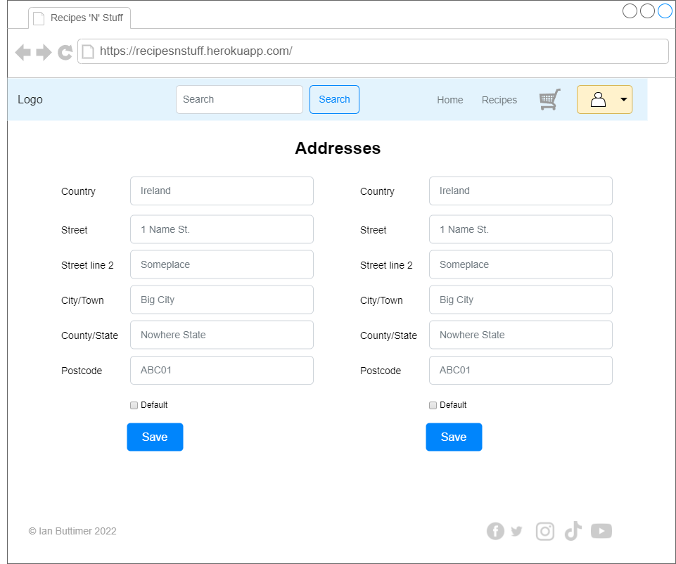
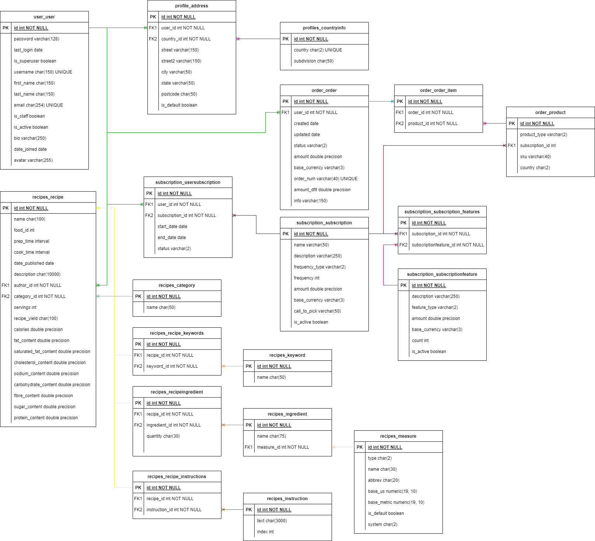

# Strategy
The strategy is to create a website allowing the user to subscribe to a plan to receive recipe suggestions and optionally purchase the required ingredients.

The target audience for the application are people wishing explore different cuisines and who are looking for a convenient method of shopping.

# Scope
The scope of the project will be to allow the user to:
- Login and logout
- Create and read recipe reviews including a rating
- Update and delete their own recipe reviews
- Follow and unfollow recipe authors

## User Stories/Objectives

### Agile methodology
An agile methodology will be used during the application development, using Google Projects as the agile tool.

The project artifacts are:
- [Recipes 'n' Stuff Development](https://github.com/users/ibuttimer/projects/2)
- [Milestones](https://github.com/ibuttimer/recipes-n-stuff/milestones)
- Project snapshots are available in the [agile](doc/agile) folder and combined summary in [management_snapshots.pdf](doc/agile/management_snapshots.pdf)

### User Stories
Epics are logged in [GitHub Issues](https://github.com/ibuttimer/recipes-n-stuff/issues?q=label%3Aepic)
User Stories are logged in [GitHub Issues](https://github.com/ibuttimer/recipes-n-stuff/issues?q=is%3Aissue+is%3Aopen+label%3A%22user+story%22)

| Title                                                                                                                | Labels                               | Description                                                                                                                                                              |
|----------------------------------------------------------------------------------------------------------------------|--------------------------------------|--------------------------------------------------------------------------------------------------------------------------------------------------------------------------|
| [Epic: Authorisation, authentication and permission features](https://github.com/ibuttimer/recipes-n-stuff/issues/5) | `kanban`, `epic`                     | Apply authorisation, authentication and permission features to application.                                                                                              |

## Objectives Implementation
TODO

# Structure
As the functionality required for users with different roles will be different, the website will utilise a tree navigation structure.

# Skeleton
The website will consist of the following pages:

| Page         | Description                                                                                                                     |
|--------------|---------------------------------------------------------------------------------------------------------------------------------|
| Landing      | The landing page will allow users to log in or register.                                                                        |
| Subscription | The subscription page will allow the user to select a subscription plan.                                                        |
| Home         | The home page will allow the user to search for recipes.                                                                        |
| Recipe       | The recipe page will allow the user to view a recipe, and optionally add the required ingredient to the shopping basket.        |
| Shopping     | The shopping page will allow the user to review the shopping basket, update quantities as required and complete their purchase. |
| Profile      | The profile page will display a user's profile and allow users to edit their own profile.                                       |
| Addresses    | The address page will allow a user to add/edit/delete addresses and set their default shipping address.                         |

# General layout

Each of the pages will have the same general layout:

- A menu at top of page, with current page highlighted.
  The buttons will contain the appropriate text, and icons will be used to visually represent the function of each page.
- A footer at bottom of page will provide general site related information.

# Wireframes
Wireframes of page layouts are as followings:

## Landing page

The Landing page will have the following features:
- The option for users to login or register

| Large screen                               | Small screen                               |
|--------------------------------------------|--------------------------------------------|
|  |  |

## Signup page

| Large screen                              | Small screen                              |
|-------------------------------------------|-------------------------------------------|
|  |  |

## Login page

| Large screen                             | Small screen                             |
|------------------------------------------|------------------------------------------|
|  |  |

## Home page

The Home page will have the following features:
- Display the user's opinion feed, and provide shortcuts to frequently used functionality.

### Home page (Following)

| Large screen                               | Small screen                              |
|--------------------------------------------|-------------------------------------------|
|   |  |


## Profile page

The Profile page will have the following features:
- Allow users to view another user's profile and edit their own profile

| Large screen                               | Small screen                               |
|--------------------------------------------|--------------------------------------------|
|  |  |

## Addresses page

The Addresses page will have the following features:
- Allow users to add/edit/delete addresses and set their default shipping address

| Large screen                                 | Small screen                                 |
|----------------------------------------------|----------------------------------------------|
|  |  |

## Subscription page

The Subscription page will have the following features:
- Allow users to select a subscription option

| Large screen                                    | Small screen                                    |
|-------------------------------------------------|-------------------------------------------------|
|  |  |

## Main page

The main page will have the following features:
- Allow users to select recipes to view

| Large screen                            | Small screen                            |
|-----------------------------------------|-----------------------------------------|
|  |  |

## Recipe page

The recipe page will have the following features:
- Allow users to view a recipe and ingredients
- Add recipe ingredients to shopping basket

| Large screen                              | Small screen                              |
|-------------------------------------------|-------------------------------------------|
|  |  |


# UX Surface
## Font
The font used for title text will be [Kanit](https://fonts.google.com/specimen/Kanit?preview.text=Recipes%20%27N%27%20Stuff&preview.text_type=custom&category=Serif,Sans+Serif) from Google fonts.
The font used for paragraph text will be [Source Serif Pro](https://fonts.google.com/specimen/Source+Serif+Pro?preview.text=Recipes%20%27N%27%20Stuff&preview.text_type=custom&category=Serif,Sans+Serif) from Google fonts.

```css
@import url('https://fonts.googleapis.com/css2?family=Kanit:ital,wght@0,300;0,400;0,500;0,600;1,300;1,400;1,500&family=Source+Serif+Pro:wght@300;400;600&display=swap');

font-family: 'Kanit', sans-serif;
font-family: 'Source Serif Pro', serif;
```


## Colour Scheme

Colour scheme courtesy of [Huemint](https://huemint.com/bootstrap-plus/#palette=e6ebeb-ffffff-00062e-5a3f6a-8c5683-cd6f6a-cc8965-ba6d4d-e6b3a0) with updates
from [Adobe Color Accessibility Tools](https://color.adobe.com/create/color-contrast-analyzer) improve contrast.

## UX Elements

No custom UX elements will be utilised, as the [Bootstrap](https://getbootstrap.com/) library provides all required elements.

## Accessibility
The guidelines outlined in the following will be followed:

- [W3C - Using ARIA](https://www.w3.org/TR/using-aria/)
- [TPGi - Short note on aria-label, aria-labelledby, and aria-describedby](https://www.tpgi.com/short-note-on-aria-label-aria-labelledby-and-aria-describedby/)


# Data
## Data Storage
Data will be stored in a [PostgreSQL](https://www.postgresql.org/) database.

### Database schema
The database schema will consist of several tables:

| Name               | Description                                |
|--------------------|--------------------------------------------|
| user               | site users                                 |
| address            | user addresses                             |
| country            | countries to ship to                       |

[]

## External Libraries
The following third party libraries will be utilised:

| Library                                                                                              | Use                                                                                                              | Description                                                                                                                                                                                                                               |
|------------------------------------------------------------------------------------------------------|------------------------------------------------------------------------------------------------------------------|-------------------------------------------------------------------------------------------------------------------------------------------------------------------------------------------------------------------------------------------|
| [django](https://www.djangoproject.com/)                                                             | Application framework                                                                                            | Django is a high-level Python web framework that encourages rapid development and clean, pragmatic design.                                                                                                                                |
| [psycopg2](https://pypi.org/project/psycopg2/)                                                       | Access PostgreSQL database                                                                                       | This library provides a complete implementation of the Python DB API 2.0 specification. It was designed for heavily multi-threaded applications that create and destroy lots of cursors.                                                  |
| [django-environ](https://pypi.org/project/django-environ/)                                           | Application configuration                                                                                        | Configuration of Django application with environment variables.                                                                                                                                                                           |
| [dj3-cloudinary-storage](https://pypi.org/project/dj3-cloudinary-storage/)                           | Cloudinary storages for both media and static files                                                              | Django Cloudinary Storage is a Django package that facilitates integration with Cloudinary by implementing the [Django Storage API](https://docs.djangoproject.com/en/4.1/howto/custom-file-storage/).                                    |
| [django-summernote](https://pypi.org/project/django-summernote/)                                     | HTML text editor                                                                                                 | Make the [Summernote](https://github.com/summernote/summernote) WYSIWYG editor available to the Django admin site and Forms.                                                                                                              |
| [django-countries](https://pypi.org/project/django-countries/)                                       | Countries for addresses                                                                                          | Country choices for use with forms, flag icons static files, and a country field for models.                                                                                                                                              |
| [gunicorn](https://pypi.org/project/gunicorn/)                                                       | Serve application on Heroku                                                                                      | WSGI HTTP Server for UNIX                                                                                                                                                                                                                 |
| [django-allauth](https://pypi.org/project/django-allauth/)                                           | User authentication and registration                                                                             | Integrated set of Django applications addressing authentication, registration, account management as well as 3rd party (social) account authentication.                                                                                   |
| [Bootstrap](https://getbootstrap.com/)                                                               | Frontend page styling                                                                                            | A powerful, extensible, and feature-packed frontend toolkit to build fast, responsive sites. See [Get started with Bootstrap](https://getbootstrap.com/docs/5.2/getting-started/introduction/).                                           |
| [Font Awesome](https://github.com/FortAwesome/Font-Awesome)                                          | Frontend icons                                                                                                   | A powerful, extensible, and feature-packed frontend toolkit to build fast, responsive sites. See [Fontawesome docs](https://fontawesome.com/docs).                                                                                        |
| [json-fix](https://pypi.org/project/json-fix/)                                                       | Serialisation of non-standard objects                                                                            | A patch to the built-in python json object that allows classes to specify how they should be serialised.                                                                                                                                  |
| [jsonpickle](https://pypi.org/project/jsonpickle/                                                    | Serialisation of non-standard objects                                                                            | Python library for serializing any arbitrary object graph into JSON. It is a library for the two-way conversion of complex Python objects and JSON.                                                                                       |
| [python-dateutil](https://pypi.org/project/python-dateutil/)                                         | Calculation of relative time deltas                                                                              | The dateutil module provides powerful extensions to the standard datetime module, available in Python.                                                                                                                                    |
| [human-friendly-pedantic-timedelta](https://pypi.org/project/human-friendly-pedantic-timedelta/)     | String formatting of time deltas                                                                                 | A Python timedelta wrapper which provides pedantic string formatting.                                                                                                                                                                     |
| [stripe](https://pypi.org/project/stripe/)                                                           | Payments processing                                                                                              | A Python library for Stripe’s API.                                                                                                                                                                                                        |
| _The following libraries will be used during development_                                            |                                                                                                                  |                                                                                                                                                                                                                                           |
| [pycodestyle](https://pypi.org/project/pycodestyle/)                                                 | [PEP8](http://www.python.org/dev/peps/pep-0008/) compliance check                                                | Python style guide checker                                                                                                                                                                                                                |
| [pytest-django](https://pytest-django.readthedocs.io/)                                               | Unit testing                                                                                                     | A framework which makes it easy to write small, readable tests, and can scale to support complex functional testing for applications and libraries.                                                                                       |
| [mixer](https://pypi.org/project/mixer/)                                                             | Unit testing test data generation                                                                                | Mixer is a helper to generate instances of Django or SQLAlchemy models. It’s useful for testing and fixture replacement. Fast and convenient test-data generation.                                                                        |
| [coverage](https://pypi.org/project/coverage/)                                                       | Code coverage testing                                                                                            | Measures code coverage, typically during test execution. It uses the code analysis tools and tracing hooks provided in the Python standard library to determine which lines are executable, and which have been executed.                 |
| [Pillow](https://pypi.org/project/Pillow/)                                                           | Image validation (required by [ImageField](https://docs.djangoproject.com/en/4.1/ref/models/fields/#imagefield)) | Imaging Library                                                                                                                                                                                                                           |
| [beautifulsoup4](https://pypi.org/project/beautifulsoup4/)<br>[lxml](https://pypi.org/project/lxml/) | Capture HTML page content                                                                                        | A library that makes it easy to scrape information from web pages. For details see the [documentation](https://www.crummy.com/software/BeautifulSoup/).<br>XML processing library. For details see the [documentation](https://lxml.de/). |
| [argon2-cffi](https://pypi.org/project/argon2-cffi/)                                                 | Generate password hashes for sample data ETL                                                                     | A library implements Argon2 version 1.3, as described in [Argon2: the memory-hard function for password hashing and other applications](https://www.cryptolux.org/images/0/0d/Argon2.pdf).                                                |
| [isoduration](https://pypi.org/project/isoduration/)                                                 | Decode ISO 8601 durations for sample data ETL                                                                    | A library providing handling of ISO 8601 durations in textual format.                                                                                                                                                                     |


